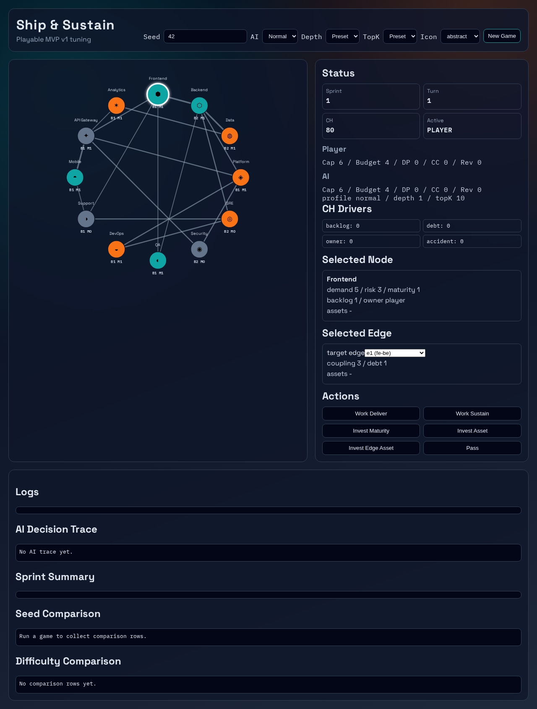
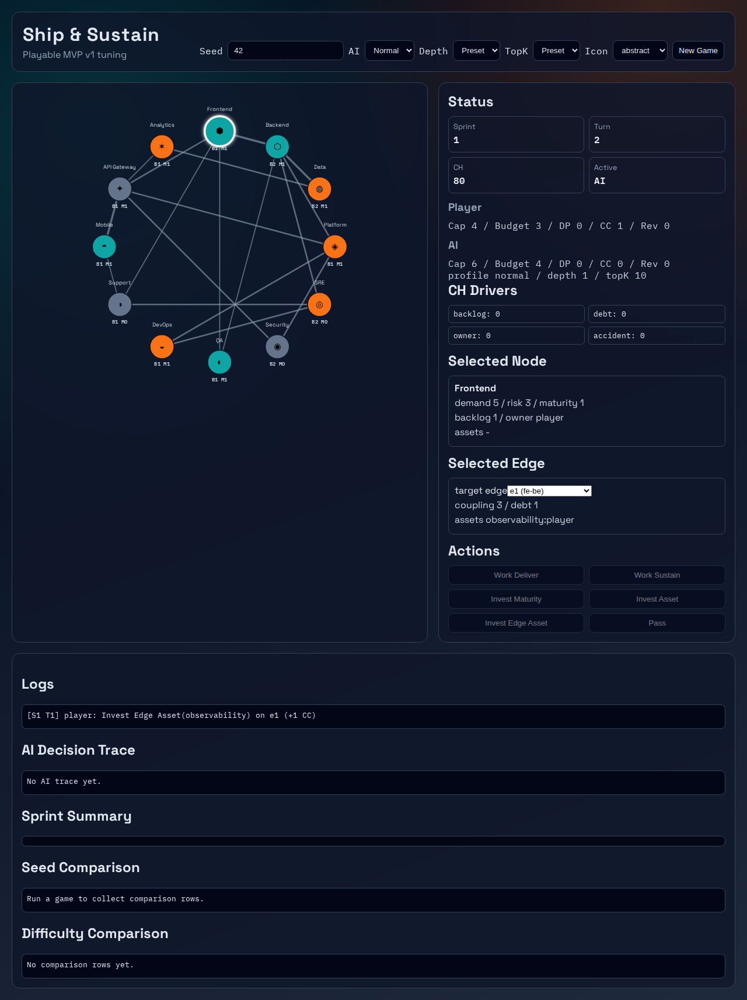
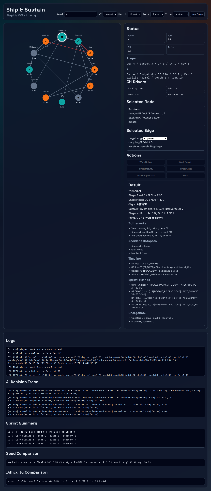

# Ship & Sustain テストプレイマニュアル

最終更新: 2026-02-18

初心者向けハンズオン: `docs/manuals/beginner-tutorial.md`

## 0. 初心者向けガイド（最初に読む）
### 0.1 ゲームの目的
- あなた（Player）とAIが、4スプリントのあいだに `Final` スコアを競うゲーム。
- `Final` は「短期成果（DP）」と「全体貢献（CCから計算されるShare）」の合計が中心で決まる。
- ただし会社体力 `CH` を落としすぎると、両者の最終点に失敗ペナルティがかかる。
  - 条件: `CH < 40`
  - 影響: `Player Final` と `AI Final` が `0.5` 倍

### 0.2 プレイヤーが毎ターン行うこと
- 盤面でノードを選び、`Actions` から1つ選んで実行する。
- 基本方針:
  - `Work Deliver` でDPを獲得する（短期成果）。
  - `Work Sustain` と `Invest` でbacklog/debt/リスクを抑え、CH悪化を防ぐ（中長期安定）。
- これを4スプリント繰り返し、`Result` で最終結果を確認する。
- 各スプリントではPlayerとAIが交互に行動し、両者の `Cap` が0になると次スプリントへ進む。

### 0.3 まず覚える数値（最重要）
- `DP`:
  - Deliverで増える成果ポイント。最終点の土台。
- `CC`:
  - Sustain/Investで主に増える全体貢献ポイント。`Share` 計算に使う。
- `CH`:
  - 会社全体の健全性。低すぎると最終点が半減する。
- `Cap`:
  - 今スプリントで使える行動力。`Work` は1、`Invest` は2消費。
- `Budget`:
  - 投資や（有効時）チャージバック支払いに使う資金。`Invest` は1消費。
- `Share`:
  - `5 × CH` の配当プールをCC比率で分配した値（各チームのDP上限あり）。

### 0.4 現在の固定パラメータ（実装値）
- スプリント数: `4`
- 初期 `CH`: `80`
- 各チームの初期 `Cap`: `6`（スプリント開始時に再設定、事故で次スプリント低下する場合あり）
- 各チームの初期 `Budget`: `4`
- CH失敗閾値: `40`（下回ると最終点 `0.5` 倍）
- 参照実装: `packages/engine/src/config.ts`

## 1. 目的
- ブラウザUIで1ゲームを完走し、主要機能が意図どおり動作することを確認する。
- 同一Seedで結果再現ができることを確認する。
- v2調整で導入した行動傾向（Edge資産投資、Sustain選択、CH推移）を観測する。

## 2. 前提条件
- Node.js 20 以上（推奨）
- pnpm 利用可能
- 依存取得済みであること

```bash
pnpm install
```

## 3. 起動手順
1. 開発サーバを起動する。

```bash
pnpm dev
```

2. ブラウザで `http://localhost:5173` を開く。

## 4. 画面の見方
### 4.0 盤面（GraphBoard）
- ノード: 開発・運用などの機能領域。クリックすると `Selected Node` が切り替わる。
- エッジ: ノード間の依存関係。エッジ候補は `Selected Edge` のプルダウンで選ぶ。

### 4.1 上部設定
- `Seed`: 乱数シード。同じ値・同じ操作なら再現性確認に使える。
- `AI`: 難易度（`easy / normal / hard`）。
- `Depth`, `TopK`: AI探索パラメータの上書き。`Preset` は難易度既定値。
- `Icon`: ノードアイコン表示モード（`abstract` / `concrete`）の切替。選択値はブラウザに保持される。
- `New Game`: 指定条件でゲームを初期化。

### 4.2 Status
- `Sprint`: 現在スプリント（1〜4）。
- `Turn`: 行動単位の通し番号。アクションが進むたび増える。
- `CH`: 会社健全性。低いほど危険。`40` 未満で失敗ペナルティ。
- `Active`: 現在の手番（`PLAYER` / `AI`）。

### 4.3 Player / AI 行
- `Cap`: そのスプリントで残っている行動力。
- `Budget`: 残資金。主に `Invest` で消費。
- `DP`: Deliver成果ポイント。
- `CC`: 全体貢献ポイント。
- `Rev`: 収益（現行既定設定ではチャージバック無効のため通常0）。

### 4.4 CH Drivers
- `backlog`: backlog起因のCH損失累計。
- `debt`: integration debt起因のCH損失累計。
- `owner`: owner付きノードで backlog が残った分の保守負担起因CH損失累計。
- `accident`: 事故イベント起因のCH損失累計（risk/backlogが高いほど発生しやすい）。
- これらは各スプリント終了時の減少要因の集計値。

### 4.5 Selected Node
- `demand`: Deliver時のDP増分の基礎値。高いほど短期成果を出しやすい。
- `risk`: 事故確率やSustain評価に関わるリスク値。
- `maturity`: Deliver効率。Deliver時DPに加算される（最大3）。
- `backlog`: 未処理負債。高いとCH悪化要因になる。
- `owner`: 所有チーム。owner一致でDeliver時 `+1 DP`。
- `assets`: そのノードの資産と所有者（`asset:owner` 形式）。

### 4.6 Selected Edge
- `coupling`: 接続の強さ。Deliver時のedge debt増加量に影響。
- `debt`: そのエッジの integration debt。高いとCH悪化要因。
- `assets`: そのエッジの資産と所有者（`asset:owner` 形式）。

### 4.7 Actions（何を押すと何が起きるか）
- `Work Deliver`（Cap 1）
  - `DP += demand + maturity + owner bonus (+ edge asset bonus条件成立時 +1)`
  - 選択ノードの `backlog +1`
  - 接続エッジの `debt` が増える
- `Work Sustain`（Cap 1）
  - 選択ノードの `backlog -2`（下限0）
  - 接続エッジの `debt -2`（下限0）
  - 条件成立で `CC +1`（高リスクノードを改善できた場合）
- `Invest Maturity`（Cap 2 + Budget 1）
  - 選択ノードの `maturity +1`（最大3）
  - `CC +1`
- `Invest Asset`（Cap 2 + Budget 1）
  - ノード資産を1つ追加
  - `CC +1`
- `Invest Edge Asset`（Cap 2 + Budget 1）
  - エッジ資産を1つ追加
  - `CC +1`
- `Pass`
  - そのチームの残りCapを0にして手番を渡す。

### 4.8 Result（終了時）
- `Winner`: 最終点の勝者。
- `Player Final / AI Final`: 最終得点。
  - `Final = DP + Share + Rev - Penalty`
  - `CH < 40` の場合は上式結果を `0.5` 倍
- `Share Player / Share AI`: `5 × CH` をCC比率で分配した値（各DPを上限に丸め）。
- `Style`: プレイヤー行動傾向（DP偏重 / 全体偏重 / バランス）。
- `Primary CH driver`: CH悪化の主因（backlog/debt/owner/accident）。
- `Bottlenecks`: backlog・risk・関連debtが大きいボトルネック上位。
- `Accident Hotspots`: 事故多発ノード上位。
- `Timeline`: 各スプリントのCH減少内訳。
- `Sprint Metrics`: 各スプリントの行動回数、DP/CC増分、CH推移。
- `Chargeback`: 支払/受取集計（現行既定設定では通常0）。

### 4.9 ログ系
- `Logs`: 実行アクションの時系列ログ。
- `AI Decision Trace`: AIが選んだ行動と候補比較（score/local/lookahead）。
- `Seed Comparison`: 直近実行結果の比較履歴。
- `Difficulty Comparison`: 難易度・探索設定ごとの集計比較。

### 4.10 画面キャプチャ（E2E取得）
以下の画像は `pnpm test:e2e` 実行時に自動更新される。

#### 初期画面（開始直後）


#### Edge資産投資後


#### 結果画面（完走後）


## 5. 基本テストプレイ（1ゲーム完走）
1. `Seed` を `42` に設定する。
2. `AI` は `normal`、`Depth/TopK` は `Preset` のままにする。
3. `New Game` を押す。
4. プレイヤーターンで以下を数回実行する。
   - `Work Deliver`
   - `Work Sustain`
   - `Invest Asset`
   - `Invest Edge Asset`
5. AIターンは自動進行するため、ログを見ながら4スプリント完了まで待つ。
6. `Result` が表示されることを確認する。

期待結果:
- ゲーム終了時に `Result` セクションが表示される。
- `Winner`, `Player Final / AI Final`, `Primary CH driver` が表示される。
- `Sprint Metrics`, `Chargeback`, `AI Decision Trace` に値が入る。

## 6. 再現性テスト（同一Seed）
1. 1回目のプレイで `Seed=42`、`AI=normal`、`Depth/TopK=Preset` を使用して完走する。
2. `Player Final`, `AI Final`, `CH` を記録する。
3. 同じ設定で `New Game` を押し、同様に完走する。
4. 結果が一致することを確認する。

期待結果:
- 同一Seed・同一設定なら、最終結果（Final/CH/Winner）が一致する。

## 7. 重点確認項目（v2）
### 7.1 Edge資産投資
1. `Selected Edge` で任意エッジを選択する。
2. プレイヤーターンで `Invest Edge Asset` を実行する。
3. `Selected Edge` の `assets` 表示に `asset:owner` が追加されることを確認する。

### 7.2 Sustain選好の確認
1. 2ゲーム以上連続実行する（Seedは `42, 43` 推奨）。
2. `AI Decision Trace` と `Difficulty Comparison` を確認する。

期待観測:
- AIが `Deliver` のみでなく `Sustain` も選択する。
- `CH Drivers` の悪化が一方向に偏りすぎない。

### 7.3 CHゲート確認
1. 連続で数ゲーム実行し、`Company Failed (CH < 40)` の表示有無を確認する。
2. 必要に応じて `docs/playlogs/v2-chargeback-summary.md` の fail rate と比較する。

## 8. 不具合報告テンプレート
不具合記録時は次を残す。
- 実行日時
- Seed
- AI設定（difficulty/depth/topK）
- 操作手順
- 期待結果
- 実際結果
- ログ抜粋（`Logs`, `AI Decision Trace`）

## 9. 補助コマンド
- 静的検証:

```bash
pnpm lint
pnpm test
pnpm build
```

- E2Eテスト + 画面キャプチャ更新:

```bash
pnpm test:e2e
```

- バランス確認:

```bash
pnpm analyze:v2:chargeback
```
